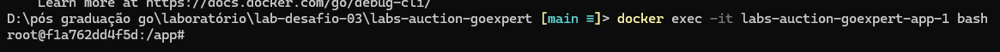
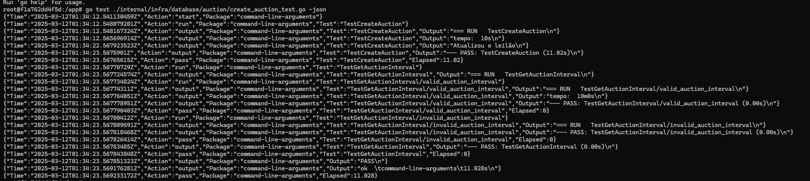
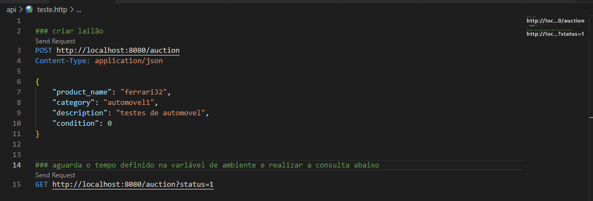
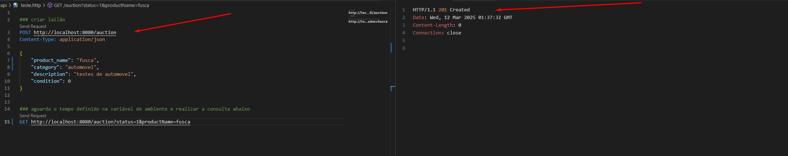
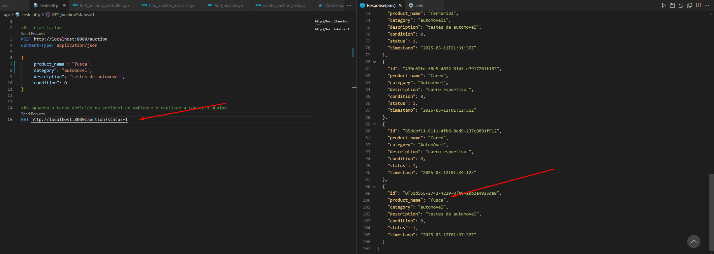

# lab-desafio-03
## detalhes do Desafio

Objetivo: Adicionar uma nova funcionalidade ao projeto já existente para o leilão fechar automaticamente a partir de um tempo definido.
Clone o seguinte repositório: clique para acessar o repositório.
Toda rotina de criação do leilão e lances já está desenvolvida, entretanto, o projeto clonado necessita de melhoria: adicionar a rotina de fechamento automático a partir de um tempo.
Para essa tarefa, você utilizará o go routines e deverá se concentrar no processo de criação de leilão (auction). A validação do leilão (auction) estar fechado ou aberto na rotina de novos lançes (bid) já está implementado.
Você deverá desenvolver:
Uma função que irá calcular o tempo do leilão, baseado em parâmetros previamente definidos em variáveis de ambiente;
Uma nova go routine que validará a existência de um leilão (auction) vencido (que o tempo já se esgotou) e que deverá realizar o update, fechando o leilão (auction);
Um teste para validar se o fechamento está acontecendo de forma automatizada;
Dicas:
Concentre-se na no arquivo internal/infra/database/auction/create_auction.go, você deverá implementar a solução nesse arquivo;
Lembre-se que estamos trabalhando com concorrência, implemente uma solução que solucione isso:
Verifique como o cálculo de intervalo para checar se o leilão (auction) ainda é válido está sendo realizado na rotina de criação de bid;
Para mais informações de como funciona uma goroutine, clique aqui e acesse nosso módulo de Multithreading no curso Go Expert; 
Entrega:
O código-fonte completo da implementação.
Documentação explicando como rodar o projeto em ambiente dev.
Utilize docker/docker-compose para podermos realizar os testes de sua aplicação.

## Como executar a aplicação e o teste
1 . Iniciar a api e o banco pelo docker-compose executar comando abaixo:
```
docker compose up -d
```
2 . Após a criação dos containers acessar o container da api pelo bash para executar o arquivo de teste, no qual vai simular a criação do leilão e depois realizar o fechamento após o perido que definido na configuração do arquivo .env <b>AUCTION_INTERVAL</b>
```
docker exec -it labs-auction-goexpert-app-1 bash
```

3 . Dentro do container da api executa o comando abaixo para executar o teste.
```
go test ./internal/infra/database/auction/create_auction_test.go -json
```

4 . O arquivo api/teste.http pode ser utilizando também para testar a criação do leilão e após o atingir o prazo de cancelamento que está definido no .env <b>AUCTION_INTERVAL</b>, consultar o Leilão para verificar o status.




